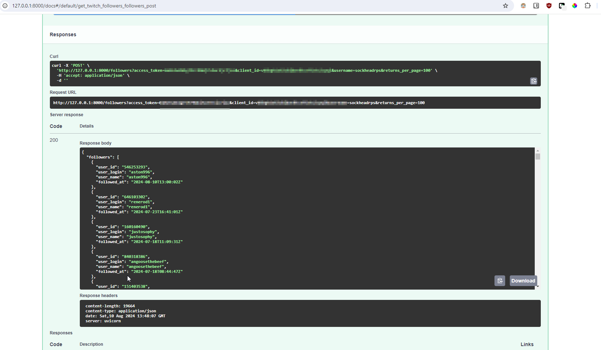

# FastAPI Followers API Server


## Overview

The **FastAPI Followers Server** is a FastAPI-based web service designed to retrieve and return the list of followers for a given Twitch broadcaster. The endpoint requires various parameters, including access token, client ID, client secret, and broadcaster username, so for that reason this tool should not be exposed on the internet, rather used as an internal API service for your application.

## Features

- **Fetch Followers:** Retrieve a complete list of followers for a specified Twitch broadcaster.
- **Handle Pagination:** Automatically manage pagination to ensure all followers are fetched.
- **Returns JSON:** Provides the follower data in JSON format.


**Query Parameters:**

- `access_token` (string, required): Your Twitch OAuth access token.
- `client_id` (string, required): Your Twitch client ID.
- `username` (string, required): The Twitch username of the broadcaster.
- `returns_per_page` (integer, optional): The number of followers to return per page. Default is 100.

### Example Request

```http
POST /followers?access_token=abc123&client_id=your_client_id&username=exampleuser&returns_per_page=50 HTTP/1.1
Host: yourapi.example.com
Content-Type: application/json
```


## Prerequisites

- Tested on Python 3.11
- [FastAPI](https://fastapi.tiangolo.com/)
- [Uvicorn](https://www.uvicorn.org/) (ASGI server)
- [aiohttp](https://docs.aiohttp.org/en/stable/) (Asynchronous HTTP client)

## Example Use:

```
pip install -r requirements.txt

uvicorn main:app
```

To test you can visit
```
http://127.0.0.1:8000/docs#/default/get_twitch_followers_followers_post
```